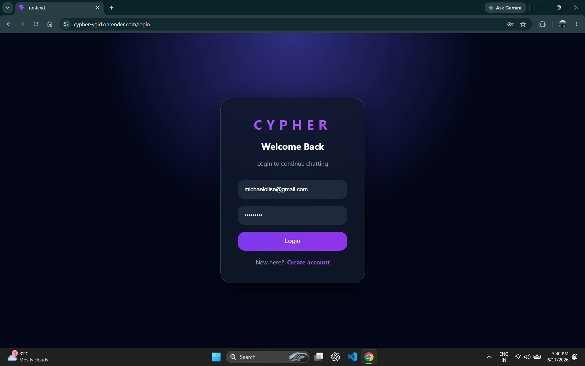
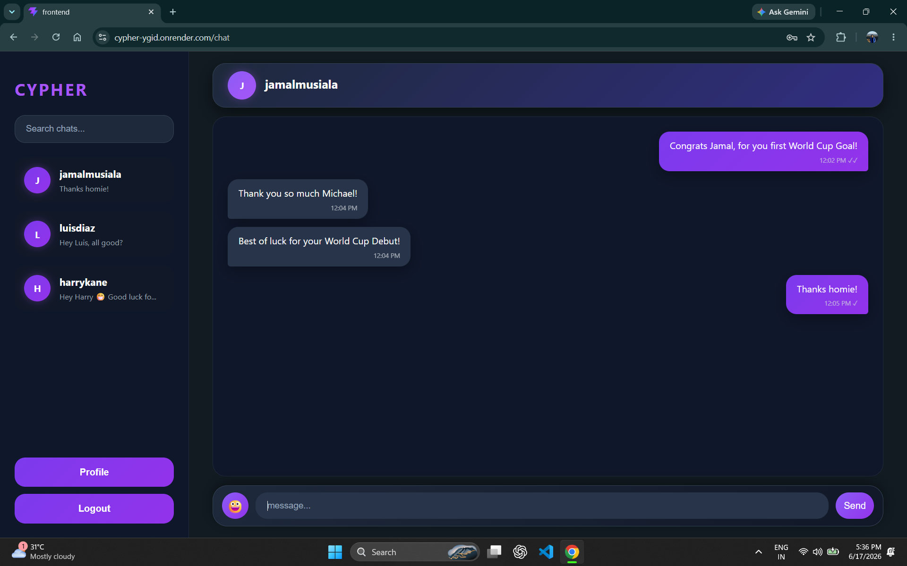

# Cypher - Real-Time Chat Application

Cypher is a full-stack real-time messaging platform that allows users to communicate through private one-to-one conversations. It provides instant message delivery, secure authentication, persistent chat history, typing indicators, and read receipts.

Built using React.js, FastAPI, MongoDB, and WebSockets.

---

## Live Demo

https://cypher-ygid.onrender.com

---

## Screenshots

### Login Page

### Chat Interface

---

## Features

- Secure user authentication using JWT
- Password hashing using bcrypt
- Real-time messaging with WebSockets
- Persistent message storage
- One-to-one private conversations
- User search functionality
- Typing indicators
- Message read receipts
- Emoji support
- Responsive user interface

---

## Tech Stack

### Frontend
- React.js
- JavaScript
- CSS
- Axios
- React Router

### Backend
- FastAPI
- Python
- WebSockets
- JWT Authentication
- Motor

### Database
- MongoDB Atlas

### Deployment
- Render

---

## Screenshots

### Login Page

### Chat Interface

## Implementation Highlights

- Developed REST APIs for authentication, user management, chats, and messages.
- Implemented WebSocket based communication for real-time message exchange.
- Designed asynchronous database operations using Motor with MongoDB.
- Added token-based protected routes for secure user sessions.
- Managed production deployment using environment variables.

---

## Future Improvements

- Group conversations
- Media sharing
- Online user status
- Push notifications

---

## Developer

Deepraj Kashyap
Electronics and Communication Engineering
National Institute of Technology Silchar